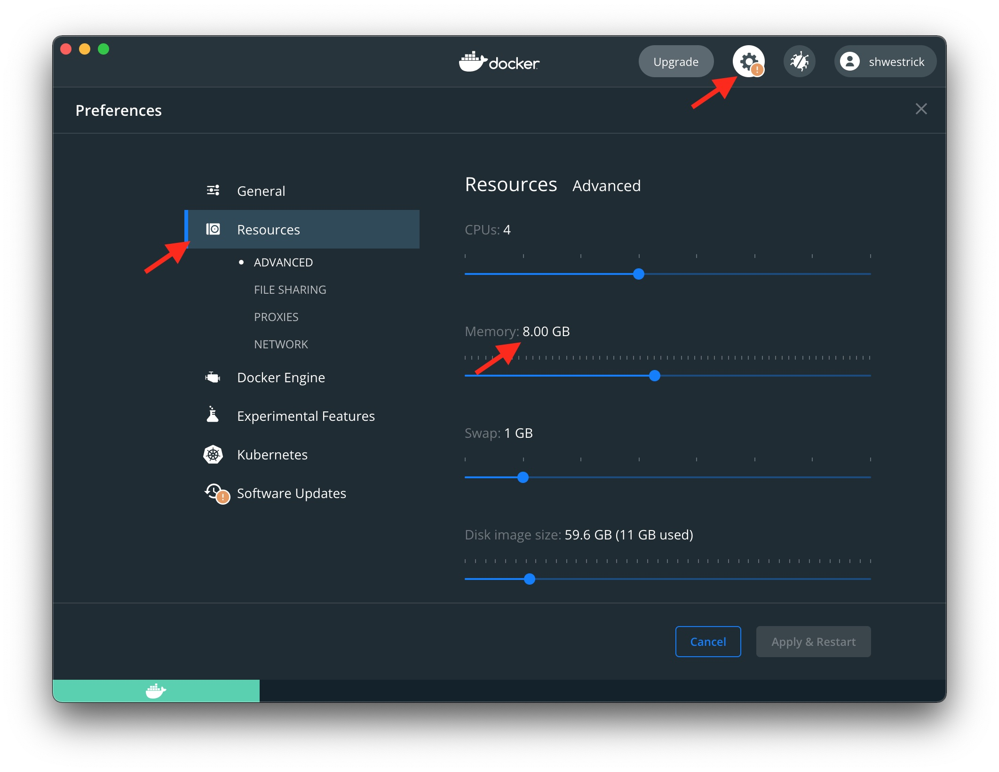

# 1: Setup

[(Hello World →)](../02-hello/README.md)

There are two options:
  1. Run the tutorial in a Docker container. [Instructions below](#option-1-docker)
  2. Install `mpl` locally on x86-64 Linux. [Instructions below](#option-2-local-install)

We recommend that you use Docker.

## Option 1: Docker

Clone this repository and then build and run a
[Docker](https://www.docker.com/) container using the top-level Dockerfile:

```
$ git clone https://github.com/MPLLang/mpl-tutorial.git
$ cd mpl-tutorial
$ ./start-container.sh
```

This opens a bash shell in the container, with a prompt that should look
something like `root@43a65ec53fc6:~#`. The directory structure inside the
container is as follows. Starting the container puts us inside the
`mpl-tutorial` directory.

```
root
├── mpl            # the MPLLang/mpl repository
└── mpl-tutorial   # this repository
```

Inside the container, the directory `mpl-tutorial` is mounted from your local
machine. Any changes within this directory will be visible both inside
and outside the container. This ensure that any changes you make will not be
lost when you exit the container, and also allows you to use any text editor
outside the container to edit files.

### MPL in the Container

In the container, you can double check that `mpl` has already been installed
(your version number may differ):

```
<container># mpl
MLton [mpl] 20200827.140808-gcce156bf3
```

There are also pre-compiled binaries in the `/root/mpl/examples/bin` subdirectory.
Let's try to run one of these.

### Primes Example
In the container, we can run the pre-compiled `primes` example with 4 processors.

```
<container># /root/mpl/examples/bin/primes @mpl procs 4 --
generating primes up to 100000000
finished in 0.6058s
number of primes 5761455
result [2, 3, 5, 7, 11, 13, 17, ..., 99999989]
```

Depending on the number of cores you computer has, you might want to use
fewer processors. The syntax for a MPL executable is
`<program> @mpl procs <num processors> --`. For
example, we can run on 1 or 2 processors, shown below.
We can see that with 2 processors, the `primes` benchmark takes about 1
second to run. This is about twice as fast as using one processor.

```
<container># /root/mpl/examples/bin/primes @mpl procs 1 --
generating primes up to 100000000
finished in 2.1835s
number of primes 5761455
result [2, 3, 5, 7, 11, 13, 17, ..., 99999989]

<container># /root/mpl/examples/bin/primes @mpl procs 2 --
generating primes up to 100000000
finished in 1.1390s
number of primes 5761455
result [2, 3, 5, 7, 11, 13, 17, ..., 99999989]
```

### Other Examples
There are a few other examples in `/root/mpl/examples/bin`
directory. They can all be called in a similar way to `primes`. See
`/root/mpl/examples/README.md` for details.

Here is running mergesort on 1 and 2 processors:
```
<container># /root/mpl/examples/bin/msort @mpl procs 1 --
./bin/msort @mpl procs 1 --
generating 100000000 random integers
sorting
finished in 27.9411s
result [0, 0, 0, 1, 1, 2, 4, ..., 99999999]

<container># /root/mpl/examples/bin/msort @mpl procs 2 --
./bin/msort @mpl procs 2 --
generating 100000000 random integers
sorting
finished in 15.1132s
result [0, 0, 0, 1, 1, 2, 4, ..., 99999999]
```

### Docker Resource Limits

By default, Docker will place a limit on how much memory a container is
permitted to use. This can cause processes inside the container to be killed,
due to the container running out of memory.

For example, you may see this when running the mergesort example, above:
```
<container># /root/mpl/examples/bin/msort @mpl procs 2 --
./bin/msort @mpl procs 2 --
generating 100000000 random integers
sorting
Killed
```

To fix this, you need to increaes the Docker memory limit. Here's how to
fix it on Mac. (Navigate to Settings -> Resources -> Memory, and set it
to a larger number, e.g. 8GB).



## Option 2: Local Install

If you are on x86-64 Linux, you can...

TODO continue from here
